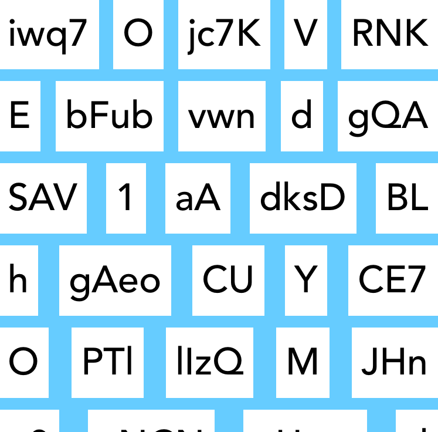

DGSelfSizingCollectionViewCells
===============================

Simple implementation of self sizing `UICollectionViewCells` introduced in iOS 8. A picture says a thousand words

This project includes several examples of how self-sizing cells can be achieved. To enable self sizing cells you firs need to set the estimatedItemSize property on `UICollectionViewFlowLayout`.

Then you need to decide on your approach for sizing your cells. You can either let auto layout do the work for you, or you can override `preferredLayoutAttributesFittingAttributes:` and return an appropriate size.

When using Auto Layout make sure that your cells are properly constrained.

When using `preferredLayoutAttributesFittingAttributes:` you will probably need to cache the size you calculate to prevent the system from calling your implementation indefinitely.
If you modify the frame of the layoutAttributes object thats passed in it will most likely call your implementation again so make sure you calculate once and then just return the layoutAttributes object.

Be warned, if you are seeking to have your collection view look similar to `UITableView` you will need to do a lot more work. 
Currently the default behaviour for flow layout is to let cells expand in a horizontal direction first. 
This means if you want to fix the horizontal dimension you either need to force a width constraint on the cell [as seen here](http://stackoverflow.com/questions/28670951/uicollectionviewcell-systemlayoutsizefittingsize-returns-incorrect-width) or [here](http://stackoverflow.com/questions/26143591/specifying-one-dimension-of-cells-in-uicollectionview-using-auto-layout)